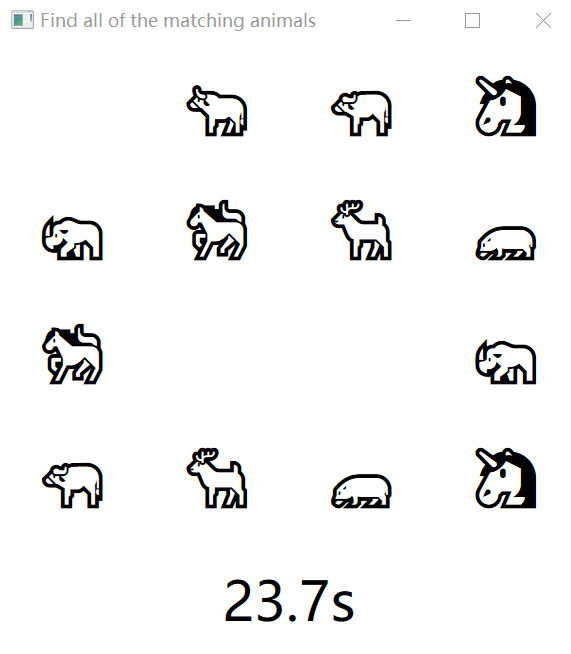

# PROJECT FOR HEAD FIRST C#

## 游戏介绍：

- 选择相同两个拼图可以将动物去掉，去掉所有动物即完成游戏

- 有计数器记录游戏时间

  

## Game Introduction:

- choose the two same animals that you may delete both of them. After all the animals deleted, you win.
- there is a timer to record the time you have spent.


> ```
> Screenshots
> ```





